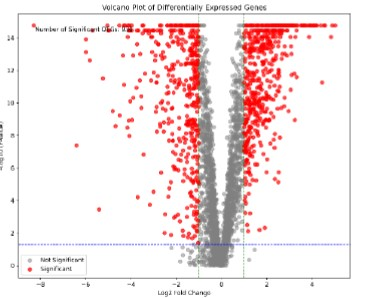
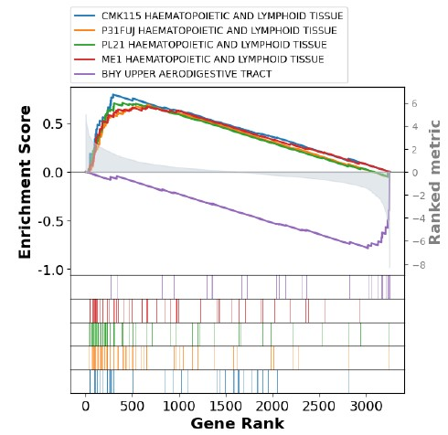

# Comprehensive Analysis of Gene Expression and Pathway Enrichment in Lung Squamous Cell Carcinoma (LUSC)

This project focuses on analyzing gene expression data to identify differentially expressed genes (DEGs) in Lung Squamous Cell Carcinoma (LUSC) and exploring their biological significance using Gene Set Enrichment Analysis (GSEA). The findings contribute to understanding LUSC mechanisms and identifying potential biomarkers and therapeutic targets.

---

## Table of Contents
1. [Introduction](#introduction)
2. [Dataset Description](#dataset-description)
3. [Methods](#methods)
   - [Data Preprocessing](#data-preprocessing)
   - [DEGs Identification](#degs-identification)
   - [Fold Change Analysis](#fold-change-analysis)
   - [Visualization](#visualization)
4. [Results](#results)
5. [Contributors](#contributors)
8. [Acknowledgments](#acknowledgments)

---

## Introduction
Lung Squamous Cell Carcinoma (LUSC) is a subtype of non-small cell lung cancer with a high mortality rate due to its complex molecular landscape. This project leverages statistical methods and enrichment analysis to uncover key genes and pathways involved in LUSC.

---

## Dataset Description
The dataset used for this study is part of the [TCGA-LUSC project](https://portal.gdc.cancer.gov/projects/TCGA-LUSC). It includes:
- **Tumor Samples**: Gene expression data from 51 cancerous tissue samples.
- **Healthy Samples**: Matched gene expression data from 51 healthy tissue samples.

---

## Methods
### Data Preprocessing
1. Filtering genes with more than 50% zero expression values.
2. Normalizing the dataset to reduce technical biases.
3. Handling missing values and ensuring data quality.

### DEGs Identification
- Paired samples analyzed using the Wilcoxon Signed-Rank Test.
- Independent samples compared using the Mann-Whitney U Test.
- Top DEGs identified based on statistical significance and fold change.

### Fold Change Analysis
Log2-transformed fold change was calculated to quantify expression differences between tumor and healthy tissues.

### Visualization
Volcano plots were generated to highlight significant DEGs based on fold change and statistical thresholds.
#### Volcano Plot Example

#### Gene Set Enrichment Visualization

---

## Results
- Over 900 significant DEGs identified.
- Volcano plots and interactive visualizations created for insights.
- Enriched pathways revealed through GSEA, offering potential therapeutic targets.

---

## Contributors
- [Omar Abd El-Nasser](https://github.com/omarshaban02)  
  Systems and Biomedical Engineering, Cairo University  
- [Mahmoud Magdy](https://github.com/MahmoudMagdy404)  
  Systems and Biomedical Engineering, Cairo University  
- [Mahmoud Mohamed](https://github.com/Mahmoudm007)  
  Systems and Biomedical Engineering, Cairo University  
- [Muhammad Ibrahim](https://github.com/Medo072)  
  Systems and Biomedical Engineering, Cairo University

---

## Acknowledgments
We acknowledge the researchers and institutions behind the TCGA-LUSC dataset for making this data accessible.

---
